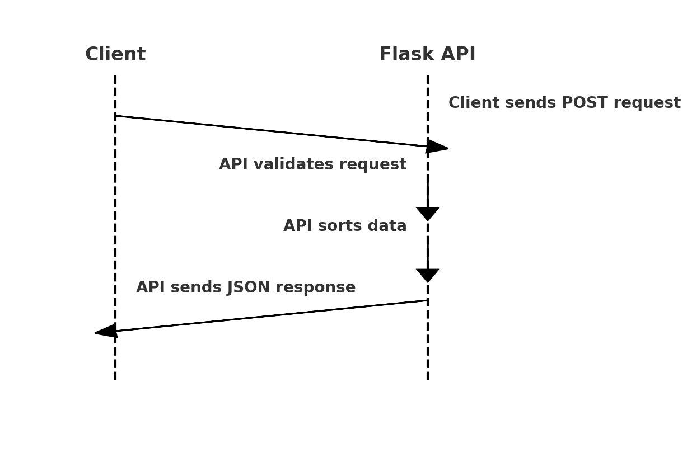

# Object Sorting Microservice

This microservice allows you to sort a dataset based on a specified key in either ascending or descending order. It can be used to sort objects in JSON format, especially useful for numerical or string values.

## Communication Contract

### Request Format:
- **Endpoint:** `/sort`
- **Method:** `POST`
- **Request Body:**
  - **data**: A list of objects that you want to sort. Each object must contain the key that will be used for sorting.
  - **key**: The key in the object by which the data will be sorted (e.g., "price").
  - **order**: The order in which you want to sort the data. Possible values: `"asc"` for ascending, `"desc"` for descending. Default is `"asc"`.

### Example Request:  
```json
{ 
  "data": [
    {"stock": "AAPL", "price": "$145.32"},
    {"stock": "GOOGL", "price": "$2753.56"},
    {"stock": "MSFT", "price": "$299.79"}
  ],
  "key": "price",
  "order": "desc"
}

### How to Send a Request Programmatically

import requests

url = "http://127.0.0.1:5000/sort"

payload = {
    "data": [
        {"stock": "AAPL", "price": "$145.32"},
        {"stock": "GOOGL", "price": "$2753.56"},
        {"stock": "MSFT", "price": "$299.79"}
    ],
    "key": "price",
    "order": "desc"
}

response = requests.post(url, json=payload)
print(response.json())

### Example Response

{
  "sorted_data": [
    {"stock": "GOOGL", "price": "$2753.56"},
    {"stock": "MSFT", "price": "$299.79"},
    {"stock": "AAPL", "price": "$145.32"}
  ],
  "index": [1, 2, 3]
}

### How to Receive Data Programmatically

import requests

url = "http://127.0.0.1:5000/sort"

payload = {
    "data": [
        {"stock": "AAPL", "price": "$145.32"},
        {"stock": "GOOGL", "price": "$2753.56"},
        {"stock": "MSFT", "price": "$299.79"}
    ],
    "key": "price",
    "order": "desc"
}

response = requests.post(url, json=payload)

if response.status_code == 200:
    data = response.json()
    print(f"Sorted Data: {data['sorted_data']}")
    print(f"Indexes: {data['index']}")
else:
    print(f"Error: {response.json()}")

### UML Sequence Diagram


